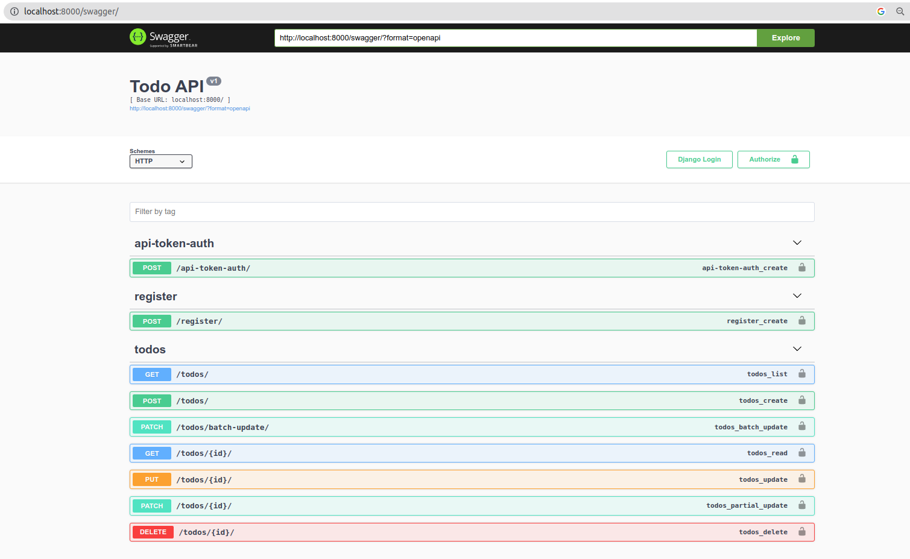
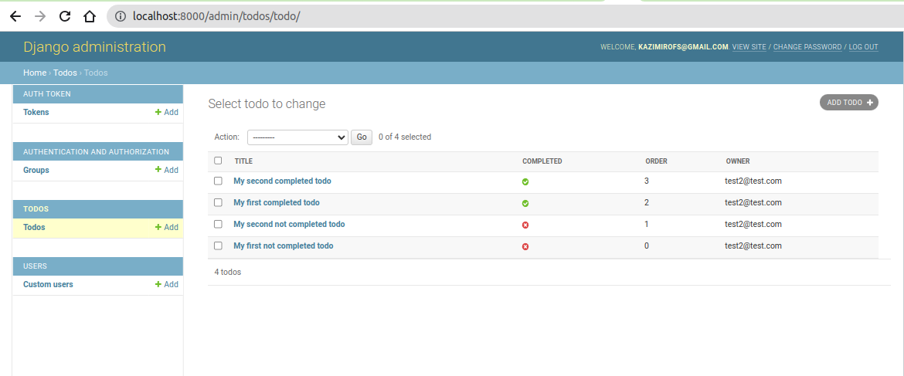
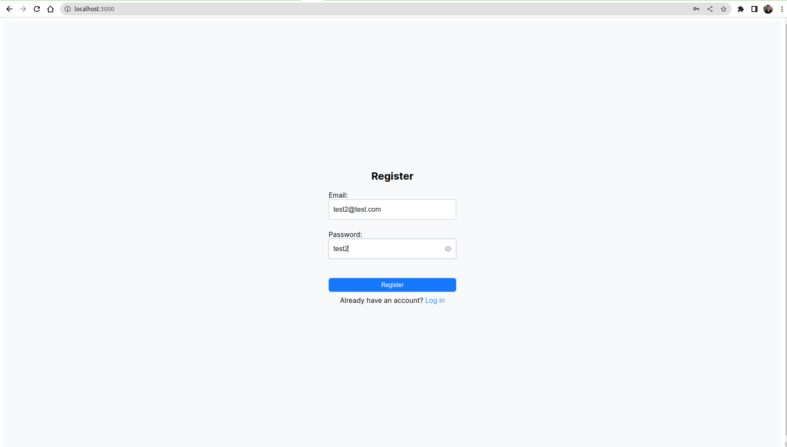
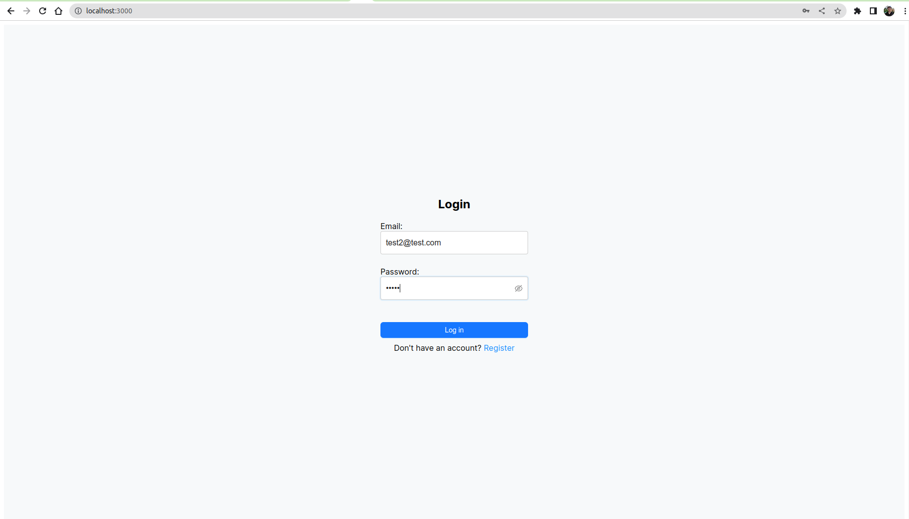
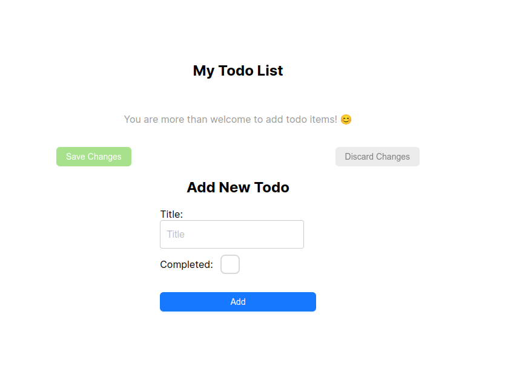
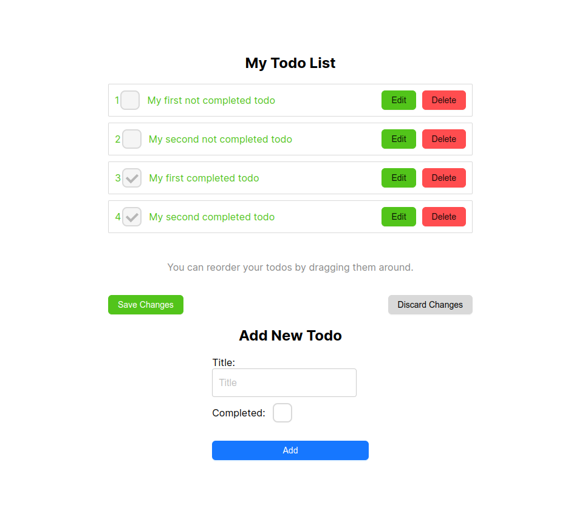
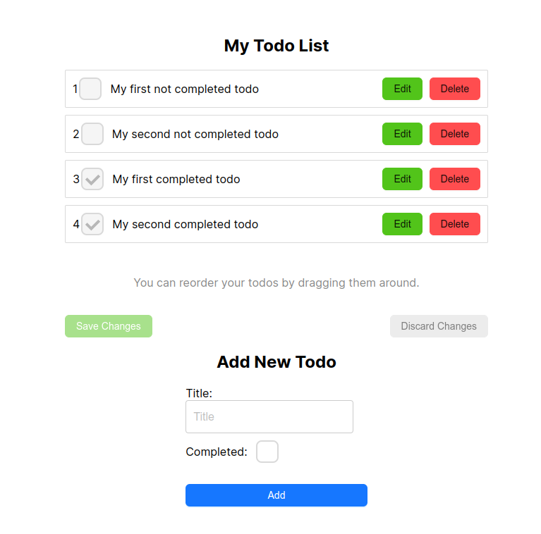
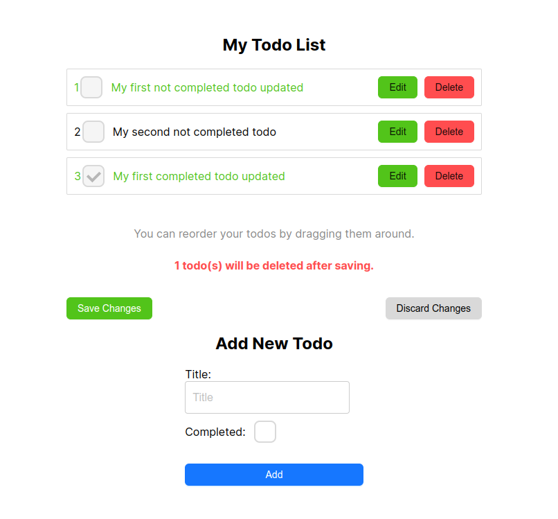

# todo-app
Django+PostgreSQL+Nest.js

**The task** was to create a TODO-list web application with the following features supported:
- Create a new todo item.
- Modify an existing todo item.
- Reorder todo items (drag & drop).
- Mark a single todo item as done.
- Save or Discard local changes.
The frontend should be set up using ReactJS and NextJS.
You should also set up a backend server, using Python/Django.
This server should connect to a DB (of any kind) in order to store the todo items.
**Notes:**
- Save changes: store local changes in DB.
- Discard changes: cancel local changes, restore local state from DB.
- Save / Discard buttons should be enabled only when there are actual changes between local todo list and DB.
- Authentication (signup/login) should not be implemented. consider a single global user for this app.
**Bonus points:**
- Good-looking UI (free to use any UI library).
- Show a list of changes (if any) at any given time.
- Implement user authentication, manage a todo list per user account.
- Additional creative features that will improve the overall outcome of the app.

  
**About implementation:**
- implemented all functionality including Bonus points
- on BE used custom User model + lots of changes for it + batch-update for drag-and-drop functionality on FE
- implemented TokenAuthentication on BE and FE
- implemented swagger for BE testing: http://localhost:8000/swagger/

- models registered on Django admin: http://localhost:8000/admin/

- FE runs on http://localhost:3000/

- tested locally - some FE bugs still possible
**How to start:**
- cd to folder with docker-compose.yml: cd todo_app
- run: docker-compose build
- run: docker-compose up
